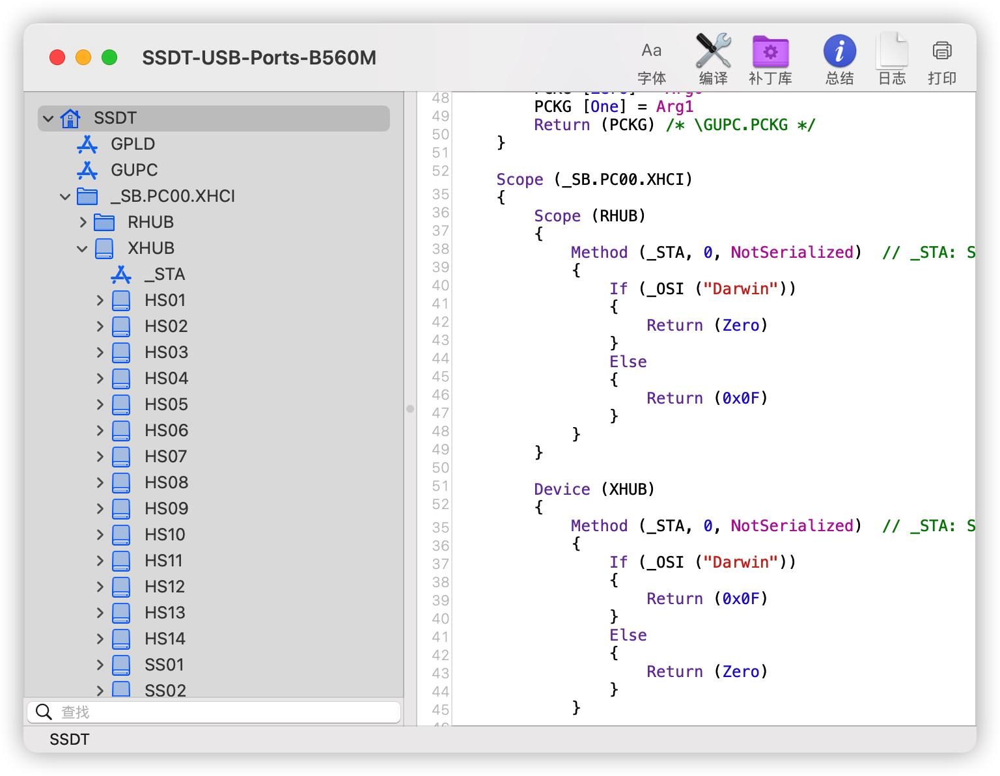
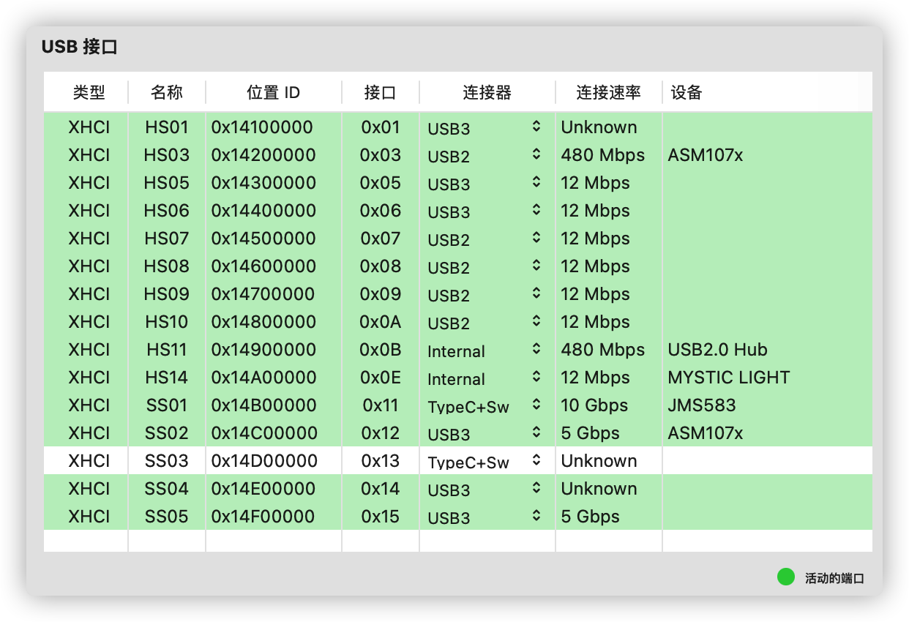
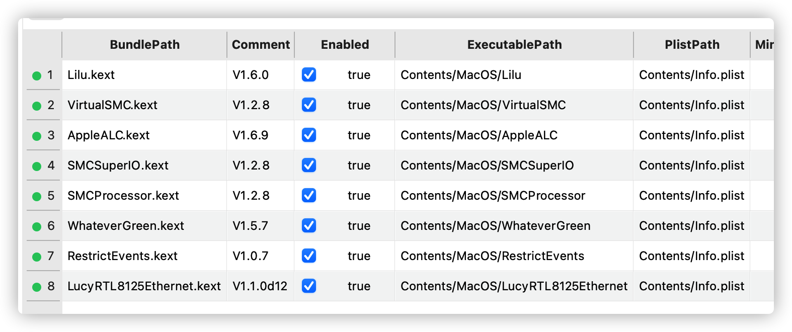

# MSI-MAG-B560M-i5-11500

|            |                                       |
| --------   |---------------------------------------|
| Mobo       | MSI-MAG-B560-MORTAR-WIFI              |
| CPU        | Intel(R) Core(TM) i5-11500            |
| RAM        | Kingston DDR4 3200  32GBx2            |
| GPU        | ONDA Radeon RX 560 典范 4GD5            |
| Network    | Realtek PCIe 2.5Gb Ethernet (RTL8125) |
| WIFI       | BCM94360CD                            |
| Disk       | WD SN850 PCIE 4.0                     |
| Input      | Apple Magic Trackpad 2                |
| Bootloader | OpenCore 0.8.1 Release                |
| System     | macOS 12.4                          |


## 状态
 - USB定制了前后面板USB、Type-C、主板USB。
 - AppleALC 897参考 [R-a-s-c-a-l的配置](https://github.com/R-a-s-c-a-l/MSI-MAG-B560M-i7-11700/issues/1),无修改，使用了原版方案
 - Wi-Fi 蓝牙 (免驱)，使用小齐家的四天线BCM94360CD。最开始用FV T919发现无线信号差，速率只有200Mbps，退了。
 - AirDrop、AirPods自动切换、iWatch解锁、屏幕镜像到AirPlay设备、Airplay投射到本设备功能正常。这些功能依赖于苹果原装网卡和蓝牙。
 - 使用Apple Magic Trackpad 2作为输入可以带来刚好的操作体验
 - 睡眠唤醒功能半正常，存在USB导致的秒醒问题。
 - SMBIOS MacPro 7,1

## changelog
### 2022.03.29
- BIOS开启USB唤醒就会导致秒醒；禁用USB唤醒不会秒醒，但需要使用电源键唤醒。
- SSDT方式禁用核显放为一个单独的文件，这样不需要使用的人可以不加载它。

### 2022.03.26
- 通过SSDT方式禁用核显，不需要在BIOS中禁用核显
- 补全了Apple SSDT中的一些设备
- 合并多个SSDT patch
- 睡眠仍存在秒醒问题，可以确定是USB导致的，目前还不能完美解决。可以在BIOS禁用USB设备唤醒来避免秒醒问题。

### 2022.03.11
- 解决了睡眠问题，可以正常睡眠唤醒，在bios中禁用了核显。暂时没搞定ssdt方式禁用核显
- 增加 SSDT-USBW.aml 和 USBWakeFixup.kext 解决usb唤醒。

## 说明

### USB定制

- 更新使用SSDT方式定制USB在xhci中增加MacOS系统使用节点,无需屏蔽acpi表。同时也不影响其他系统对USB的识别。
  > update: 排查bootlog，发现启动加载 USB Table (SSDT-5-xh_rksu4.aml Table)是失败的，所以这个表可屏蔽可不屏蔽。反正都不会加载。

  发现HS02接口是该主板的内置蓝牙HCI，增加了屏蔽。避免干扰免驱卡蓝牙。



当前USB定制展示



| 名称 | 类型          | 说明                                 |
| ---- | ------------- | ------------------------------------ |
| HS01 | Typec 2.0     | SS01 主板后面板 Typec接口的2.0模式   |
| HS02 | USB 2.0       | 主板内置蓝牙使用的接口，已禁用         |
| HS03 | USB 2.0       | 主板后面板三个蓝色USB3接口的2.0模式  |
| HS04 | USB 2.0       | 主板内置usb 3.2的usb2接口，已禁用         |
| HS05 | USB 2.0       | SS04 前面板usb3接口的2.0模式         |
| HS06 | USB 2.0       | SS05 前面板usb3接口的2.0模式         |
| HS07 | USB 2.0       | 后面板四个usb2.0接口左1              |
| HS08 | USB 2.0       | 后面板四个usb2.0接口左2              |
| HS09 | USB 2.0       | 后面板四个usb2.0接口左3              |
| HS10 | USB 2.0       | 后面板四个usb2.0接口左4              |
| HS11 | 内建          | 主板上USB插口，接了pci网卡上的蓝牙   |
| HS14 | 内建          | 主板RGB控制器                        |
| SS01 | Typec 3.0 10G | 主板后面板Typec接口的3.0模式         |
| SS02 | USB 3.0 5G    | 主板后面板三个蓝色USB3接口           |
| SS03 | Typec 3.0 10G | 主板内置usb 3.2 10G接口 |
| SS04 | Usb 3.0 5G    | 前面板usb 3.0接口                    |
| SS05 | Usb 3.0 5G    | 前面板usb 3.0接口                    |


- 使用USBMap定制USB可以参考 release v1.0版本中的 USBMap.kext


### AppleALC 897
AppleALC组件使用了原版方案，使用`device-id=D07A0000`、`layout-id=66`等参数。


----------------
### 展示


```
EFI
├── BOOT
│   └── BOOTx64.efi
└── OC
    ├── ACPI
    │   └── SSDT-MSI-B560M.aml
    ├── Drivers
    │   ├── ExFatDxe.efi
    │   ├── HfsPlus.efi
    │   ├── OpenCanopy.efi
    │   └── OpenRuntime.efi
    ├── Kexts
    │   ├── AppleALC.kext
    │   ├── Lilu.kext
    │   ├── LucyRTL8125Ethernet.kext
    │   ├── RadeonSensor.kext
    │   ├── RestrictEvents.kext
    │   ├── SMCProcessor.kext
    │   ├── SMCRadeonGPU.kext
    │   ├── SMCSuperIO.kext
    │   ├── USBWakeFixup.kext
    │   ├── VirtualSMC.kext
    │   └── WhateverGreen.kext
    ├── OpenCore.efi
    └── config.plist

16 directories, 8 files
```




----------------
## 鸣谢

\- [Mieze](https://github.com/Mieze) 提供 [LucyRTL8125Ethernet](https://github.com/Mieze/LucyRTL8125Ethernet).

\- [Acidanthera](https://github.com/acidanthera) 提供 [AppleALC](https://github.com/acidanthera/AppleALC), [RestrictEvents](https://github.com/acidanthera/RestrictEvents), [Lilu](https://github.com/acidanthera/Lilu), [OcBinaryData](https://github.com/acidanthera/OcBinaryData), [OpenCorePkg](https://github.com/acidanthera/OpenCorePkg), [VirtualSMC](https://github.com/acidanthera/VirtualSMC) ,[WhateverGreen](https://github.com/acidanthera/WhateverGreen)

\- 参考了配置文件[R-a-s-c-a-l](https://github.com/R-a-s-c-a-l/MSI-MAG-B560M-i7-11700), [sqlsec](https://github.com/sqlsec/MSI-MAG-B560M-MORTAR-i7-10700)

\- 参考 [USB MITTELS SSDT DEKLARIEREN](https://www.hackintosh-forum.de/forum/thread/54986-usb-mittels-ssdt-deklarieren/?pageNo=1)
